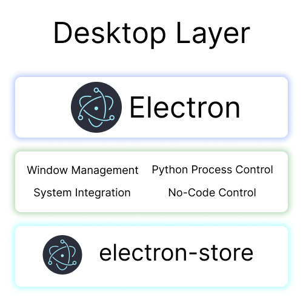

# Simple ETL
> Simple ETL tool that makes ETL process easier, no-code like 

# Goal

Not everyone enjoys the repetitive grind of manual cloud configuration and writing the same boilerplate code for every new task. Simple ETL aims to make data movement less tedious and more efficient—saving you time and getting your results delivered faster.

# Idea

When you need to modify, prepare, or transform your data, you can simply boot the application and select your required actions. From there, you can either:

1. **Process it directly:** Get your data fully transformed and ready to use.
2. **Generate Snippets:** Get the exact code snippets you need to paste and run the logic on your own platform.

## System Architecture

### Front-end Layer

**React + TypeScript**
- Modern UI with Vite

**Components**
- ETL Configuration UI
- Data Source Selector
- Transformation Builder
- Job Monitor

**State Management**
- TanStack Query (Server)
- Zustand (Client)

---
### Back-end Layer

**FastAPI + Python**
- Async REST API

**Core Services**
- ETL Engine
- Data Connectors
- Transformation Logic
- Job Logger

**Data Processing**
- Dual-engine support with **Pandas** and **Polars**

### Desktop Layer 

**Electron**
- Cross-platform wrapper

**Main Process**
- Window Management
- Python Process Control
- System Integration
- No-Code Control

**Local Storage**
- electron-store

